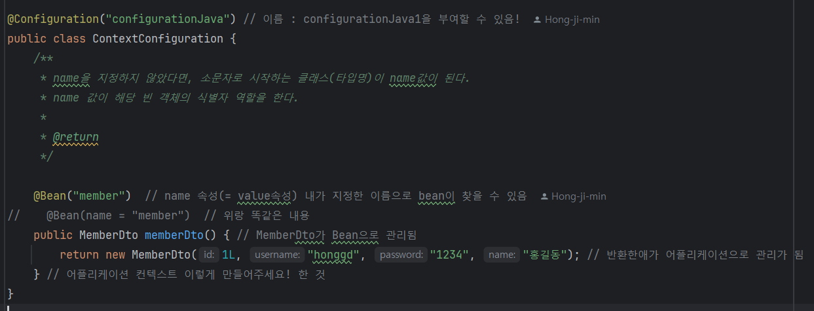
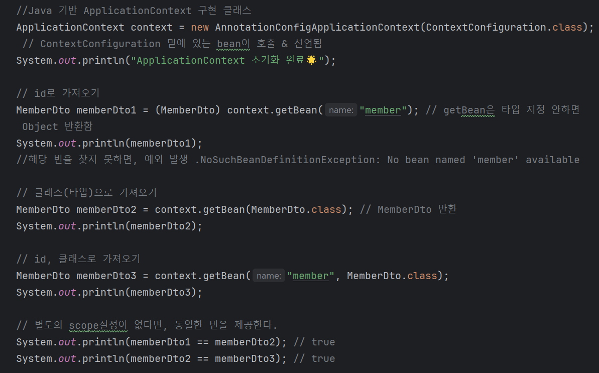
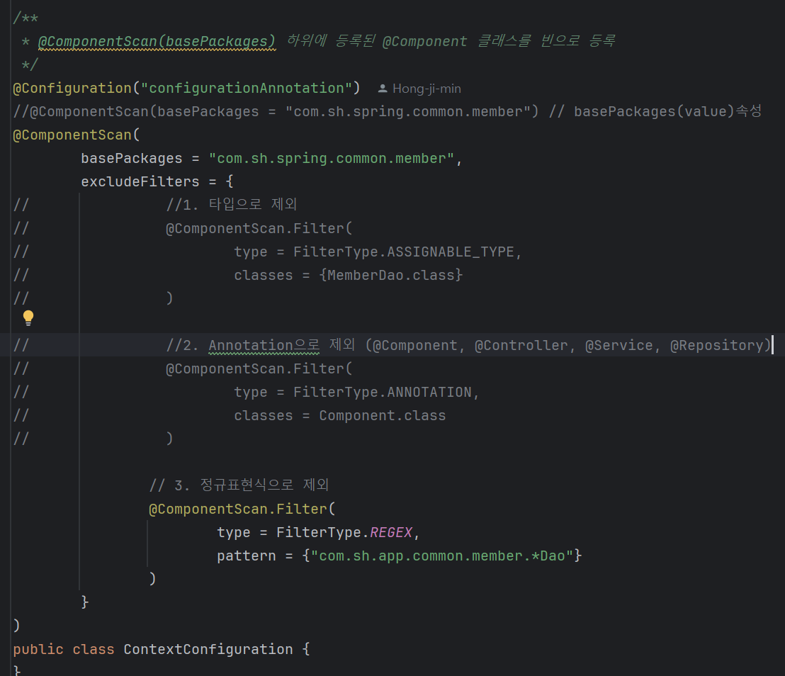
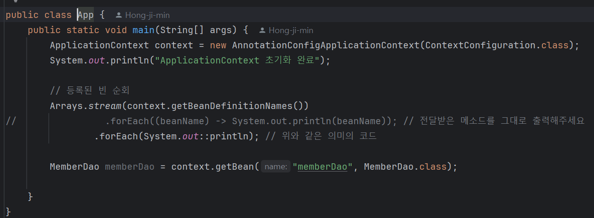

> # Spring이란?
* ### Java 기반의 애플리케이션 프레임워크
* 동적인 웹 사이트를 개발하기 위한 여러가지 서비스를 제공하고 있다.
<br/>
* Spring 사이트 :  https://spring.io/
## 프레임워크(Frame Work)


* ### 목적에 맞게 필요한 것을 이용할 수 있도록 만들어놓은 ```구조화된 틀```
<br/>

## Spring의 특징

* **IoC(Inversion of Control)** : 원래 컨트롤의 흐름이 뒤집어졌다는 의미
    - 객체를 만들어서 관리하던 책임을 프레임워크로 넘겨졌다는 의미를 뜻함
- **DI(Dependency Injection)** : 만들어진 객체( = 의존성, dependency)을 주입해준다(Injection)는 뜻
    - 프레임워크가 관리하는 자바 객체 = Bean
<br/>
<br/>
    
> # 1. IoC
## IoC Container


- IoC를 구현한 프레임워크
- 객체의 생성, 초기화, 의존성 처리 등을 자동으로 실행할 수 있다.
- 스프링 프레임워크 안에 빈을 관리하는 또 다른 객체가 있다. →  그 객체 = ApplicationContext(= IoC Container)
<br/>
<br/>

## ApplicationContext (IoC Container)구성

- 가장 먼저 해야 할 일은 ApplicationContext( = interface)를 만드는 것!
1. **xml 기반(spring legacy)**
2. **java기반** : AnnotationConfigApplicationContext 객체 생성
    - ```@Configuration ``` + ```@Bean```
      - 사용 예시
        
        
    - ```@Configuration``` + ```@ConponentScan```
      - 사용 예시
        - 
        - 


> # 2. DI(Dependency Injection)
## dfdf


```

```
